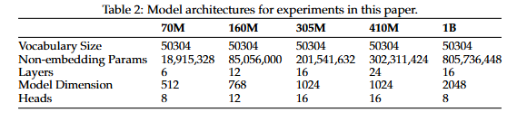
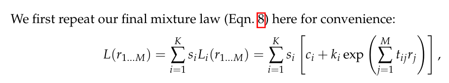
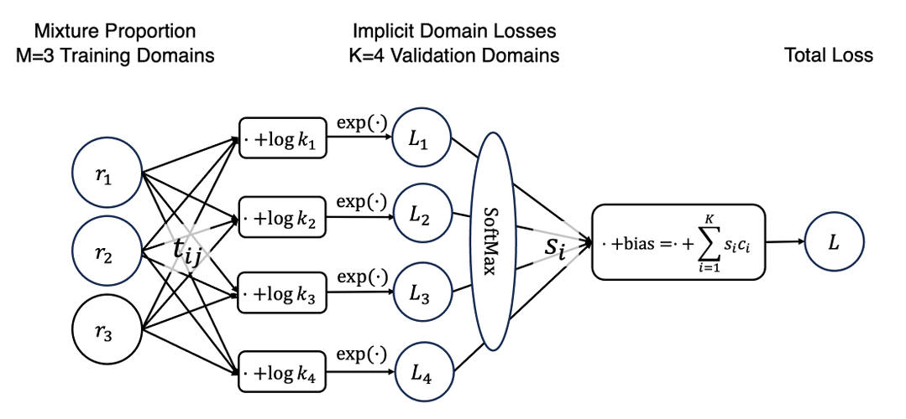

# How to Upscale Neural Networks with Scaling Law? A Survey and Practical Guidelines
## Scaling Data-Constrained Language Models: https://github.com/huggingface/datablations  
**dense3**

| Field                   | Description |
| ----------------------- | -------------------------------------------------- |
| N     |  模型参数            |
| D     | 训练总token消耗 |
| uD     |   唯一token数   |
| loss     |           |

meta data:

| meta                   | value |
| ----------------------- | -------------------------------------------------- |
| count     |  231/293            |
| max N     | 9b |
| min N     |   10m   |

N->get more arch info

## Data Mixing Laws: Optimizing Data Mixture by Predicting Language Modeling Performance: https://github.com/yegcjs/mixinglaws/tree/main

**dense4**：3mix and 2mix
**dense5**：5mix

mixinglaws/data/
├── RPJ.predictions.json
├── 2Mix/
│   ├── 160M.txt  #len = 110
│   └── 70M.txt  #len = 110
├── 3Mix/
│   ├── 160M.txt # len = 2155
│   ├── 410M.txt # len = 104
│   └── 70M.txt # len = 1001
├── 5Mix/
│   ├── 160M.txt # len = 7162
│   ├── 1B.txt # len = 418
│   ├── 305M.txt # len = 8008
│   ├── 410M.txt # len = 6292
│   ├── 70M.txt # len = ?
├── ct/
│   └── 70M.txt
└── RedPajama/
    ├── 160M.txt
    ├── 1B.txt
    ├── 305M.txt
    ├── 410M.txt
    ├── 70M.txt
    └── proportions.txt

| Field                   | Description |
| ----------------------- | -------------------------------------------------- |
| N     |  参数模型，采用Pythia架构（文档D.1节表2）             |
| n-filed     | e.g. 3 |
| n-mix-ratio     | e.g. 0.25 0.5 0.25 |
| train-step     |    e.g. 25000   |
| valid data     |      e.g. github     |
| loss     | 负对数似然损失（公式(2)）          |
| D     | fixed D = 30B           |

| 混合场景 | 训练数据核心特征                | 训练数据具体来源（Pile数据集）                | 验证数据核心特征                | 验证数据具体来源（Pile数据集）                          |
|----------|---------------------------------|-----------------------------------------------|---------------------------------|---------------------------------------------------------|
| 2-mix    | 2个细粒度领域，数据纯粹无重叠   | Github + Pile-CC                              | 与训练领域一一对应（或通用验证） | Github验证集 + Pile-CC验证集（或Pile通用验证集）        |
| 3-mix    | 3个细粒度领域，覆盖多样文本类型 | Github + Pile-CC + Books3                     | 与训练领域一一对应              | Github验证集 + Pile-CC验证集 + Books3验证集             |
| 5-mix    | 5个粗粒度领域，确保数据量充足   | Academic + Internet + Prose + Dialogues + Misc | 与训练领域对应（或隐式聚合）    | 5个粗粒度领域验证集（或Pile通用验证集，按隐式领域处理） |

one hot encode:

other feature:

所有模型的训练批次大小（batch size）均设为 100 万 token，训练总步数为 3 万步（30k steps），对应训练数据总量为 300 亿 token（30B tokens）。

**interesting**: E Connections between Implicit Domain Aggregation and MLP

## Unified Scaling Laws for Routed Language Models: https://github.com/google-deepmind/scaling_laws_for_routing

**moe2**

| Field                   | Description |
| ----------------------- | -------------------------------------------------- |
| `hyper_id`              | A unique identifier per hyperparameter setting |
| `step`                  | The number of training steps the model has trained for before doing that evaluation round. |
| `router_type`           | The technique used to learn and execute the routing. Can be one of `Dense`, `Hash`, `S-Base` and `RL-R`. These techniques are described in Section 3 of the paper. |
| `num_experts`           | The number of experts per routed layer in the model (referred as *E* in the paper). |
| `k`                     | The number experts used per datapoint, *i.e.* if  k=2, the output of the routed layer per token will be an aggregation of two experts. |
| `routing_frequency`     | The fraction of transformer blocks that have a routed layer. *e.g.* a routing_frequency of 0.5 means every other block will be routed, while a frequency of 0.25 means there are three dense blocks between routed blocks. |
| `flop_increase`         | Only relevant for `Dense` models. When  `flop_increase > 1`, the size of the feedforward layer is increased by this factor. This emulates the increase in flops that occurs when increasing `k` in routed models. |
| `d_model`               | The transformer's width parameter. |
| `num_blocks`            | The number of transformer blocks in the model. |
| `num_heads`             | The number heads in the Multihead Attention modules. |
| `kqv_size`              | The dimensionality for the keys, queries and values of each attention head. |
| `seed`                  | The random seed used to initialize the weights. As described in Appendix A, we only varied the seed for a small subset of the runs. |
| `total_parameter_count` | The total number of parameters int the model, including those of all the experts |
| `dense_parameter_count` | The number of parameters seen by a single datapoint. Refer to the paper for a discussion on the distinction of "dense" counts (N) and "total" counts (P) (*e.g.* in Section 2.1) |
| `flops_per_step`        | An estimate of the number of flops for a model's forward-step. |
| `model_size_label`      | A label for the model's size. This should roughly  match `dense_parameter_count`. Can be one of  `15M`, `25M`, `55M`, `130M`, `370M`, `870M` or  `1.3B`. |

| Field                   | Description |
| ----------------------- | -------------------------------------------------- |
| `loss_validation`       | Negative log-likelihood on a held-out portion of the original dataset. |
| `loss_c4`               | Negative log-likelihood on C4 |
| `loss_curation_corpus`  | Negative log-likelihood on the Curation Corpus  dataset. |
| `loss_lambada`          | Negative log-likelihood on the LAMBADA task. |
| `loss_pile`             | Negative log-likelihood on The Pile dataset, EuroParl subset. |
| `loss_wikitext103`      | Negative log-likelihood on the Wikitext103  dataset.|

### meta info
| 信息                 | 值       | 
|--------------------|----------------|
| 总数量                | 5799    |
| 有效数量               | 223           |
| 数据集类型              | moe预训练           |
| 包含LLM架构数量          | 7    |
| LLM Min parameters | 15M    |
| LLM Max parameters | 1.3B    |

**note that**: all model was trained on 130B token data and never over-fitting. so the training dataset token count is 130B
**reference**: Models were trained with a sequence length of 2048 and batch size of 256 for 250,000 steps, i.e. 130 billion tokens, regardless of N

## Predictable Scale: Part II, Farseer: A Refined Scaling Law in Large Language Models
**dense2**

## Predictable Scale: Part I — Optimal Hyperparameter Scaling Law in Large Language Model Pretraining
**dense1** **moe**

## Chinchilla Scaling: A replication attempt
**dense6**